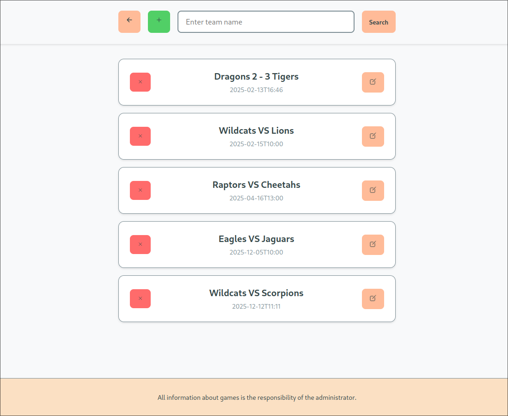
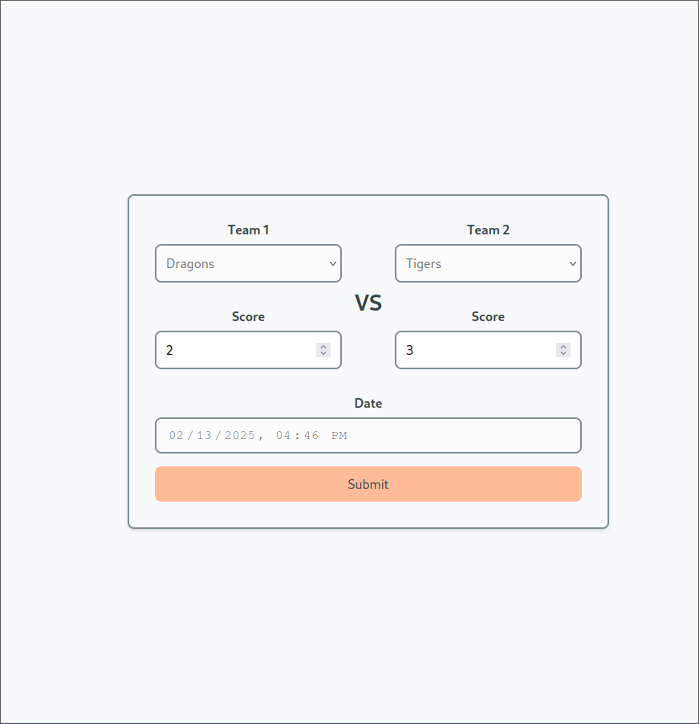

# Node.js Homeworks Repository

This repository contains the homework assignments throughout the Node.js backend course.

So far, 4 homework assignments have been implemented. There are 6 homework assignments in total.

## Homework 1 - Hello, world!

The introductory homework involves implementing just console.log('Hello, world!');

## Homework 2 - About the team.

This homework assignment involves a little disclosure about our team. We had to use a templating engine to dynamically load information onto pages.

## Homework 3 - Project Creation

Express.js was used to implement the project along with dynamic pages using EJS templating engine. Data storage and handling was implemented using .json files. Since the homework required writing data input/output using synchronous, asynchronous callback, asynchronous async/await, these 4 types of data handling were scattered over the project functionality: searching for games, adding games, deleting games and editing them.

### Showcase

**Admin side home page:**

**Game Editing:**

## Homework 4 - Transferring data to the database.

This homework involved replacing saving data in .json files with a database. The logic of data retrieval and editing was rewritten. ORM was not allowed in this homework because it will be used in the 5th homework.
